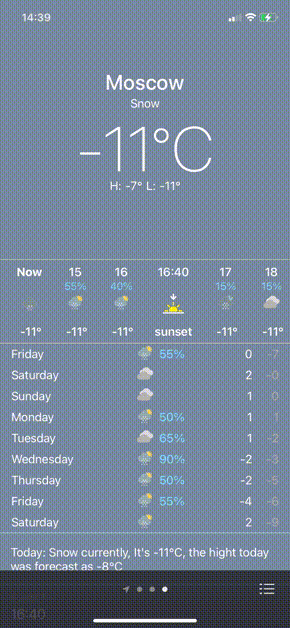
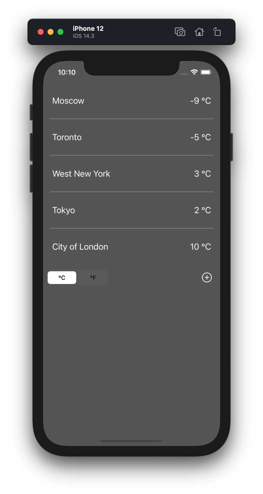

# iOS 14 Apple Weather App


A simple clone of the native Apple Weather App that gets weather data using the weatherbit API.


## Purposes:
* Repeating of basic concepts of swift language
* Using different ways to accomplish tasks.
* Introducing Swifty JSON and Alamofire libs

## Features
* Using the MVC architecture
* Alamofire
* Swifty JSON
* Cocoa Pods
* Designing an interface using storyboard
* Animations

### Background color, depending on the weather condition and time of the day
<div>


</div>

### Scroll Animation
 
<br>

### Main Screen
 
 
## Screenshots

<div>


</div>
<br>
<div>



</div>

## Usage
To run the example app, clone the repo and open file named `WeatherApp.xcworkspace`. All pods are already installed.

## Pods
The application uses the Alamofire and Swifty JSON libraries
```
   pod 'Alamofire', '~> 5.2'
   pod 'SwiftyJSON', '~> 4.0'
```

## Weather API
* [Weatherbit](https://www.weatherbit.io) - Weather API

## Code Style Guide
* [The Official raywenderlich.com Swift Style Guide.](https://github.com/raywenderlich/swift-style-guide)

